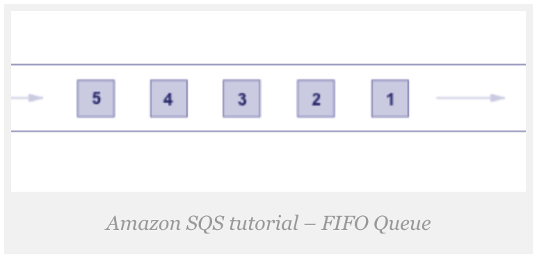
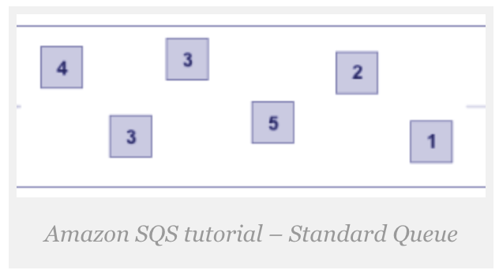
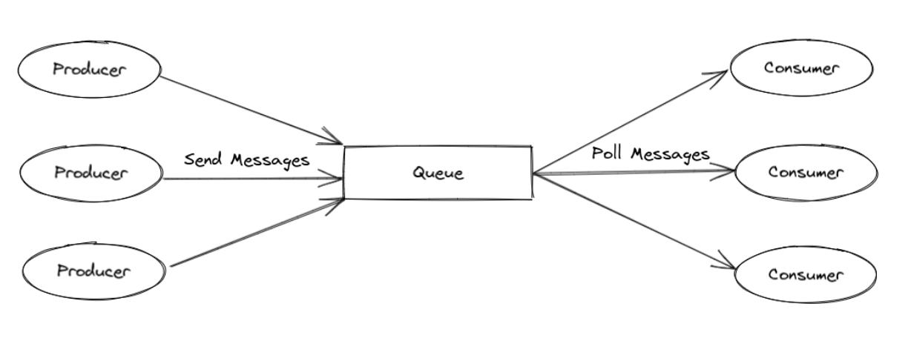

# Learning AWS: SQS and S3

## Amazon Simple Queue Service (Amazon SQS)

_SQS is a managed message queuing service used to send, store and retrieve multiple messages of various sizes
asynchronously._

It provides an HTTP API through which items can be submitted to and readout of a queue by apps. AWS fully manages the
queue itself, making SQS an easy solution for passing messages between different components of software systems running
in the cloud.

- there are 2 types: `FIFO` and `Standard`;
  (The frequency of message delivery differs between standard and FIFO queues, as FIFO messages are delivered **exactly
  once**, while in standard queues, messages are delivered **at least once**)
- safely exchange messages between different software components;
- supports tasks that process `asynchronously`. This means that rather than a single application needing to invoke
  another one directly, the app can simply send a message into a queue, where it waits. Other applications can then
  access the message later.

Standard queues allow a high number of inflight messages. If the majority of your messages can't be consumed and aren't
sent to a dead-letter queue, your rate of processing valid messages can slow down. Thus, to maintain the efficiency of
your queue, make sure that your application correctly handles message processing.

   

### How does SQS work?

SQS provides a message-submitting API endpoint and another endpoint to read messages from a queue. Each message can only
be retrieved once, and at the same time, you can have many customers submit messages and read messages from a queue.
Unformatted strings, XML, or JSON may be the messages that SQS manages.

A message queue is lighter than an internal HTTP API. SQS also manages items such as automatic retries, maintaining
queue status in AWS across various availability zones, and keeping track of expiry timeouts on all messages.

1. _Send message_: a service sends a message to a queue, which becomes available for another service to consume;
2. _Receive message_: another service can request the queue to receive pending messages;
3. _Delete message_: after a message has got properly processed, the consumer can delete it from the queue;

SQS does not work as a database and the consumer can’t determine which message to receive from the queue. It can,
though, specify how many messages it wants to receive at each time.

### Pros

- You only get charged for the messages you read and write when using SQS.
- Size the SQS queues to the number of messages you write and read. **You don’t need to scale the queues**;
- AWS takes care of all of the scaling and performance-at-scale aspects. SQS will do the job of removing any duplicate
  messages for you for FIFO queues.
- All messages that can not be processed are sent to a `dead-letter queue` where they can be checked.

### Cons

- SQS does not accept a way for multiple organizations to retrieve the same message, making SQS not so effective for
  one-to-many broadcasts. To address this, you can use **SQS** alongside **SNS** in cases where one-to-many delivery is
  necessary.

### Amazon SQS delay queues

Delay queues let you postpone the delivery of new messages to consumers for a number of seconds, for example, when your
consumer application needs additional time to process messages. If you create a delay queue, any messages that you send
to the queue remain invisible to consumers for the duration of the delay period.

**Note**: Delay queues are similar to visibility timeouts because both features make messages unavailable to consumers
for a specific period of time. The difference between the two is that, for delay queues, a message is hidden when it is
first added to queue, whereas for visibility timeouts a message is hidden only after it is consumed from the queue.

To set delay seconds on individual messages, rather than on an entire queue, use message timers to allow Amazon SQS to
use the message timer's DelaySeconds value instead of the delay queue's DelaySeconds value. Message timers let you
specify an initial invisibility period for a message added to a queue.

### Configuration

- The default visibility timeout (TTL) for a message is 30 seconds. The minimum is 0 seconds. The maximum is 12 hours.
- The default (minimum) delay for a queue is 0 seconds. The maximum is 15 minutes.
- SQS message retention period (MessageRetentionPeriod) is 14 days. After that time message will be deleted from the
  queue.

## Amazon Simple Storage Service (S3 Bucket)

S3 stands for `simple storage service`, and it is AWS’s cloud storage service. S3 provides the ability to store,
retrieve, access, and back up any amount of data at any time and place.

As S3 is `object-based storage`, this means that all data is stored as `objects`. Each object has three main components:

1. The object’s content
2. The object’s unique identifier
3. The object’s metadata (including its name, size, URL)

Amazon sets no cap on the total volume or number of items that can be stored in S3, but individual objects can’t be
larger than 5 gigabytes, the limit on a single upload. S3 provides tools for uploading large objects in parts and
migrating big data into storage.

AWS S3 is a `key-value store`, one of the major categories of NoSQL databases. Uploaded objects are referenced by a
unique key, which can be any string.

### References

https://docs.aws.amazon.com/AWSSimpleQueueService/latest/SQSDeveloperGuide/sqs-delay-queues.html